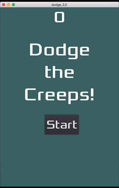
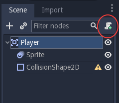
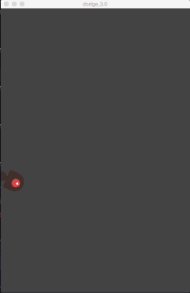

# Your First Game (2D)

## Overview

This tutorial will guide you through making your first Godot Engine project. You will learn how the Godot Engine editor works, how a project is structured, and how to build a basic 2D game.

The game is called _"Dodge the Creeps"_. Your character must move and avoid the enemies for as long as possible.  Here is a preview of the final result:



>   **Why 2D?**
>    Beginners are urged to focus on 2D projects until they have a good understanding of the game development process. 3D games are significantly more complex, so stick to 2D until you feel confident in your ability.

## Project Setup

Start by launching Godot and making a new project. Then, download the **!LINK TO ASSETS!** _game assets_ - the images and sounds you'll be using.  Unzip these files in your new project folder.

>   For this tutorial, we will assume you are already familiar with the Godot Engine editor window. If you haven't read the **!LINK TO EDITOR OVERVIEW!**, do so now.

#### Organizing the Project

In this project, we will be making 3 independent scenes: `Player`, `Mob`, and `HUD`, which we will combine into the game's `Main` scene.  In a larger project, it might be useful to make folders to hold the various scenes and their scripts, but for this simple game, you can save your scenes and scripts in the root folder, which is called `res:\\`.

## Player Scene

#### Node Structure
Add the following nodes to the scene:

`Area2D`
    - `AnimatedSprite`
    - `CollisionShape2D`

The `Area2D` node will represent our player.  We are using `Area2D` so that we can detect other objects colliding (i.e. running into) the player. A more complex physics body is not necessary, since we don't need to worry about bouncing or pushing the player.

Change the name of the `Area2D` node to `Player`, the `AnimatedSprite` to `Sprite` and save the scene (click Scene -> Save, or press `Meta-s`).

>   **A Note on Naming**
>   In this project, we will be following the Godot Engine naming conventions.  Classes (Nodes) use `CapWords`, variables and functions use `snake_case`, and constants use `ALL_CAPS`.

#### Sprite Animation
The `AnimatedSprite` will handle the animations for our player. Notice that there is a warning symbol next to it.  An `AnimatedSprite` requires a `SpriteFrames` resource, which is a list of the animation(s) it can display. To create one, find the `Frames` property in the Inspector and click `<null>` -> `New SpriteFrames`. Next, in the same location, click `<SpriteFrames>` to open the "SpriteFrames" editor window:


Finally, add a shape to the `CollisionShape2D`. For this character, a `CapsuleShape2D` gives the best fit:


>   **Tip:** Remember not to scale the CollisionShape! Only use the size handles (red) to adjust the shape!

#### Moving the Player

Now it's time to add a script. Click the `Player` node and click the "Add Script" button:

In the script settings window, you can leave the default settings, just click "Create":


>   If this is your first time encountering GDScript please read the **!LINK TO GDSCRIPT OVERVIEW!** first.

Start by declaring the member variables this object will need:

```
extends Area2D

var SPEED = 400  # how fast the player will move (pixels/sec)
var velocity = Vector2()  # the player's movement vector
var screensize  # size of the game window
```
The `ready()` function is called when a node enters the scene tree, so that's a good time to find the size of the game window:

```
func _ready():
    screensize = get_viewport_rect().size
```

Now we will use the `_process()` function to define what the player will do every frame: check for input, move in the given direction, and play the appropriate animation.

First, we need to check the inputs - is the player pressing a key? For this game, we need 4-directional movement, so there are 4 directions to check.  You can detect whether a key is pressed using `Input.is_action_pressed()`.

```
func _process(delta):
    if Input.is_action_pressed("ui_right"):
        velocity.x = 1
    elif Input.is_action_pressed("ui_left"):
        velocity.x = -1
    if Input.is_action_pressed("ui_down"):
        velocity.y = 1
    elif Input.is_action_pressed("ui_up"):
        velocity.y = -1
    velocity *= SPEED
```

However, this results in two problems:

*   If you hold down both "left" and "right" at the same time, the player will move left (because of the order of the `if` statement).
*   If you hold down both "up" and "right" at the same time (or any other diagonal) the combined `x` and `y` velocity will result in the player moving faster due to the Pythogorean theorem (about 40% faster, in fact).

We can solve both of these problems, as well as reduce the amount of code, by taking advantage of the fact that in GDScript `true/false` values are equivalent to `1/0` and combine the opposite keys to get a resulting direction.

Then, we _normalize_ the velocity, which means we set its _length_ to `1`, and multiply by the desired speed. This means no more fast diagonal movement.

We also check whether the player is moving so we can start/stop the AnimatedSprite animation.

```
func _process(delta):
    velocity.x = Input.is_action_pressed("ui_right") \
                 - Input.is_action_pressed("ui_left")
    velocity.x = Input.is_action_pressed("ui_down") \
                 - Input.is_action_pressed("ui_up")
    if velocity.length() > 0:
        velocity = velocity.normalized() * speed
        $Sprite.play()
    else:
        $Sprite.stop()
```

Now that we have a movement direction, we update the player's position and use `clamp()` to prevent it from leaving the screen:

```
    position += velocity * delta
    position.x = clamp(position.x, 0, screensize.x)
    position.y = clamp(position.y, 0, screensize.y)
```

Click "Play the Edited Scene. (F6)" and confirm you can move the player around the screen in all directions.

#### Choosing Animations

Now that the player can move, we need to change which animation the AnimatedSprite is playing based on direction.  We have a "right" animation, which should be flipped horizontally (using the `flip_h` property) for left movement, and an "up" animation, which should be flipped vertically (`flip_v`) for downward movement.

```
    if velocity.x != 0:
        $Sprite.animation = "right"
        $Sprite.flip_v = false
        $Sprite.flip_h = velocity.x < 0
    elif velocity.y != 0:
        $Sprite.animation = "up"
        $Sprite.flip_v = velocity.y > 0
```

Play the scene again and check that the animations are correct in each of the directions.

#### Preparing for Collisions

We want the player to detect when it is hit by an enemy, but we haven't made any enemies yet! However, that's OK because we're going to use Godot's _signal_ functionality to make it work.

Add the following at the top of the script (after `extends Area2d`):

```
signal hit
```

This defines a custom signal called "hit" that our player will emit (send out) when it is hit.  Now we need to use the Area2D to detect the collision.  Select the `Player` node and click the "Node" tab next to the Inspector to see the list of signals the player can emit:


Our custom "hit" signal is there as well! Since our enemies are also going to be Area2D nodes, we want the `area_entered( Object area )` signal - that will be emitted when another area contacts the player.  Click "Connect.." and then "Connect" again on the "Connecting Signal" window - we don't need to change any of those settings.

Godot will automatically create the following function in your player's script, and you can add this code to it:

```
func _on_Player_area_entered( area ):
    hide()
    emit_signal("hit")
    monitoring = false
```
**!NOTE ABOUT MONITORING!**

The last piece for our player is to add
```
func start(pos):
	position = pos
	show()
	monitoring = true
```

## Enemy Scene

Now it's time to make the enemies our player will have to dodge. Their behavior will be very simple:  Mobs will spawn randomly at the edges of the screen and move in a straight line (in a random direction), then despawn when they go offscreen.

We will build this into a `Mob` scene, which we can then _instance_ to create any number of independent mobs in the game.

#### Node Setup

The Mob scene will use the following nodes:

`Mob (Area2D)`
    - `Sprite (AnimatedSprite)`
    - `CollisionShape2D`
    - `Visible (VisibilityNotifier2D)`

Set up the AnimatedSprite like you did for the player. This time, we have 3 animations: "fly", "swim", and "walk". Don't forgetWe'll select one of these randomly so that the mobs will have some variety.


Again, add a `CapsuleShape2D` for the Collision and then save the scene and attach a script.

#### Enemy Script

Add the following member variables:
```
extends Area2D

var MIN_SPEED = 200
var MAX_SPEED = 250
var mob_types = ["walk", "swim", "fly"]
var velocity = Vector2()
var screensize
var direction
```

`MIN_SPEED` and `MAX_SPEED` set the limits for how fast the mobs can go - it would be boring if they were all the same speed.

Now let's look at the rest of the script:

```
func _ready():
    screensize = get_viewport_rect().size
    randomize()
    $Sprite.animation = mob_types[randi() % mob_types.size()]
    choose_start_location()

func _process(delta):
    position += velocity * delta

func choose_start_location():
    # pick a random screen edge
	var edge = randi() % 4
    # based on edge, pick a random spot on that edge
    # and set the direction to point into the screen
	if edge == 0:  # top
		position = Vector2(rand_range(0, screensize.x), 0)
		direction = PI/2
	elif edge == 1:  # right
		position = Vector2(screensize.x, rand_range(0, screensize.y))
		direction = PI
	elif edge == 2:  # bottom
		position = Vector2(rand_range(0, screensize.x), screensize.y)
		direction = PI * 3/2
	elif edge == 3:  # left
		position = Vector2(0, rand_range(0, screensize.y))
		direction = 0
    # add some randomness to the direction
	direction += rand_range(-PI/4, PI/4)
	# textures are oriented pointing up, so add 90deg
	rotation = direction + PI/2
	velocity = Vector2(rand_range(MIN_SPEED, MAX_SPEED), 0).rotated(direction)
```

>   **A Note on Randomization**
>   You must use `randomize()` if you want your sequence of "random" numbers to be different every time you run the scene. `randi() % n` is a quick way to get a random integer between `0` and `n-1`.

The last piece is to make the mobs delete themselves when they leave the screen. Connect the `screen_exited()` signal of the `VisibilityNotifier2D` and add this code:

```
func _on_Visible_screen_exited():
    queue_free()
```

Now run the scene and check that you see a single mob spawn and move across the screen. Try it a couple of times to see different mob types.



## Main Scene

Instancing
    - Player (in GUI)
    - Mobs (in code)

Create a new scene and add a `Node` called `Main`. Click the "Instance" button and select your saved `Player.tscn`.


>   See the Beginner's Guide **!LINK TO ENGINE OVERVIEW!** to learn more about instancing.

Now add the following nodes as children of `Main`:

-   `MobTimer (Timer)` - to control how often mobs spawn
-   `ScoreTimer (Timer)` - to increment the score
-   `StartTimer (Timer)` - to give a delay before starting
-   `StartPos (Position2D)` - indicates the player's start position

Set the `Wait Time` property of each of the `Timer` nodes as follows:

-   `MobTimer`: `0.5`
-   `ScoreTimer`: `1`
-   `StartTimer`: `2`

In addition, set the `One Shot` property of `StartTimer` to `On` and set `Position` of the `StartPos` node to `(240, 450)`. Now add a script to `Main`.

#### Main Script

```
extends Node

var Mob = preload("res://Mob.tscn")
var score

func _ready():
    $Player.connect("hit", self, "game_over")

func new_game():
    score = 0
    $Player.start($StartPos.position)
    $StartTimer.start()

func game_over():
    $ScoreTimer.stop()
    $MobTimer.stop()

func _on_MobTimer_timeout():
	add_child(Mob.instance())

func _on_StartTimer_timeout():
	$MobTimer.start()
	$ScoreTimer.start()

func _on_ScoreTimer_timeout():
	score += 1
```

## HUD

```
extends CanvasLayer

signal start_game

func _input(event):
	if event.is_action_pressed("ui_select"):
		if $StartButton.is_visible():
			$StartButton.emit_signal("pressed")

func show_message(text):
	$Message.text = text
	$Message.show()
	$MessageTimer.start()

func game_over():
	show_message("Game Over")
	yield($MessageTimer, "timeout")
	$StartButton.show()
	$Message.text = "Dodge the\nCreeps!"
	$Message.show()

func update_score(score):
	$ScoreLabel.text = str(score)

func _on_StartButton_pressed():
	$StartButton.hide()
	emit_signal("start_game")

func _on_MessageTimer_timeout():
	$Message.hide()
```

#### Score Timer

#### Displaying Messages

#### Restarting the Game

## Finishing Up

#### Sound Effects

#### Particles

#### Background
